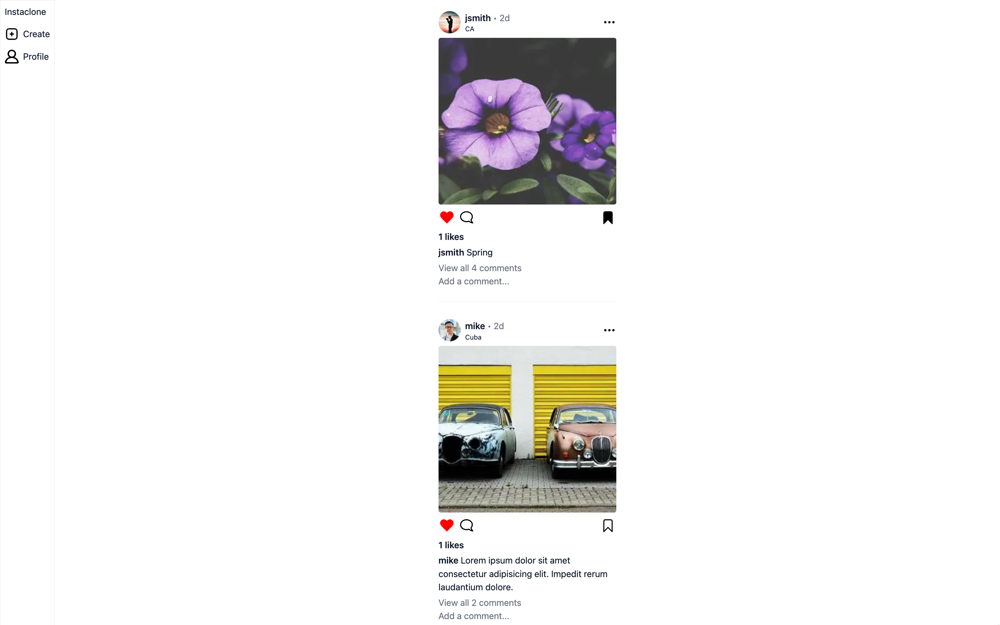
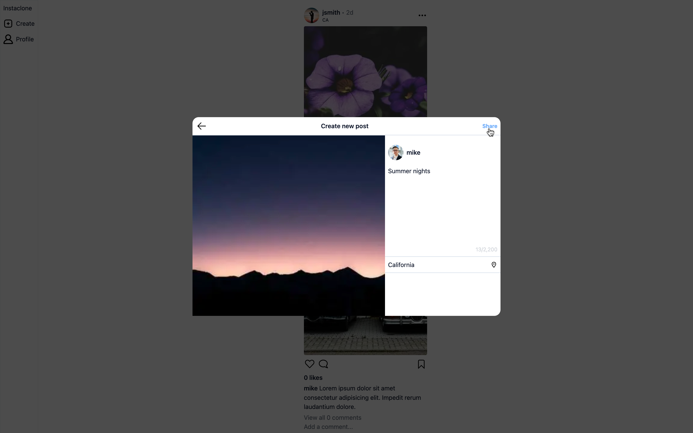
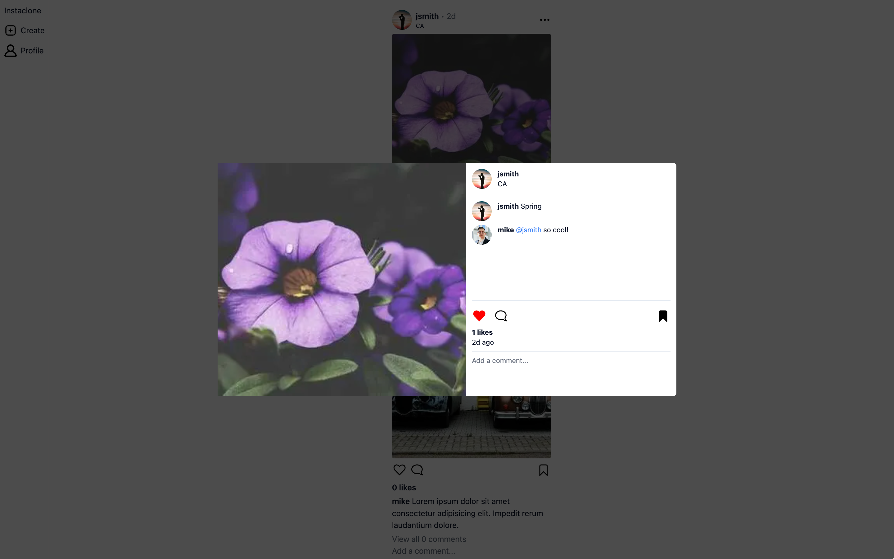

# Instagram Clone

This is an Instagram clone that locally implements many of the features present in the parent app

## Stack

- Frontend: React & Typescript
- Styling: Tailwind
- State managment: Redux
- Hosting: NextJS
- Packages: shadcn, clsx, nanoid, linkify, swr, tailwind-merge
- Photo source: lorem.picsum

## Features

- [View feed](#view-feed)
- [Create](#create-a-post), like or [save](#save-posts) a post
- [View users Profiles](#view-profiles)
- [Follow other users](#view-profiles--follow-users)
- [Mention other users](#mention-users)

## Installation

1. Clone the repo

```
$ git clone https://github.com/allmtz/insta.git
```

2. `cd` into the cloned project

3. Install the npm dependencies

```
$ npm install
```

### View Feed



### Create a post



### Save posts


### View Profiles & Follow Users


### Mention users


